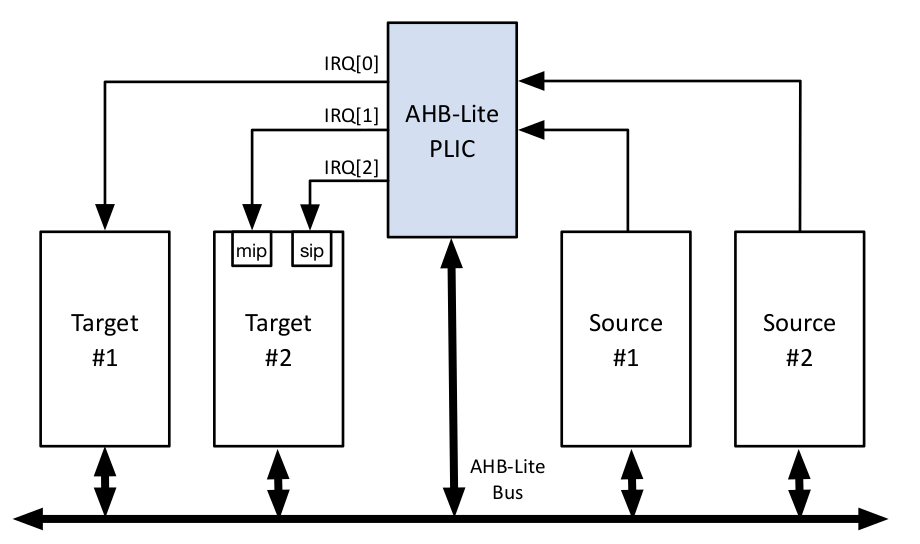
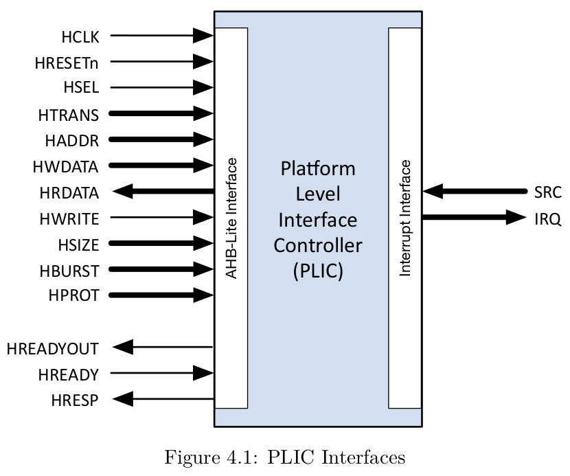
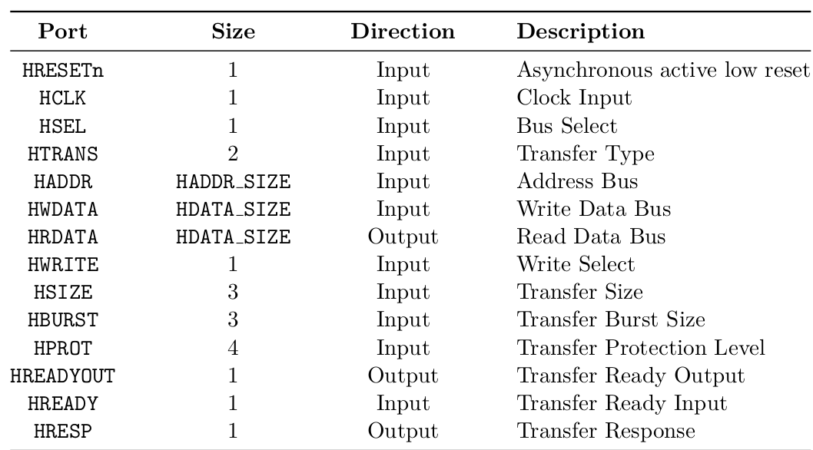
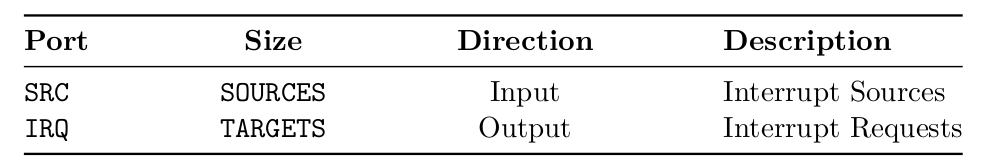
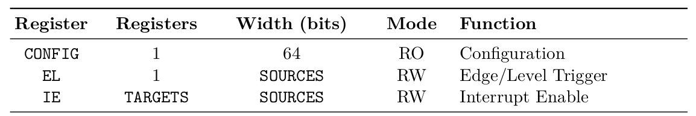
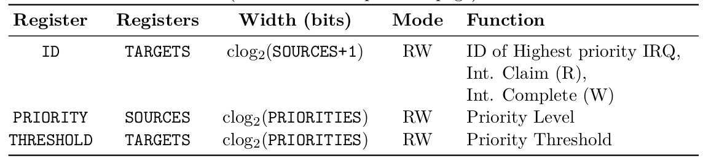
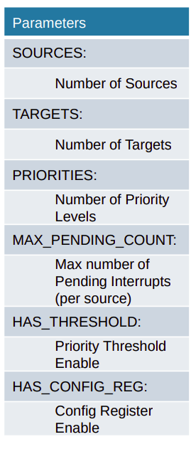
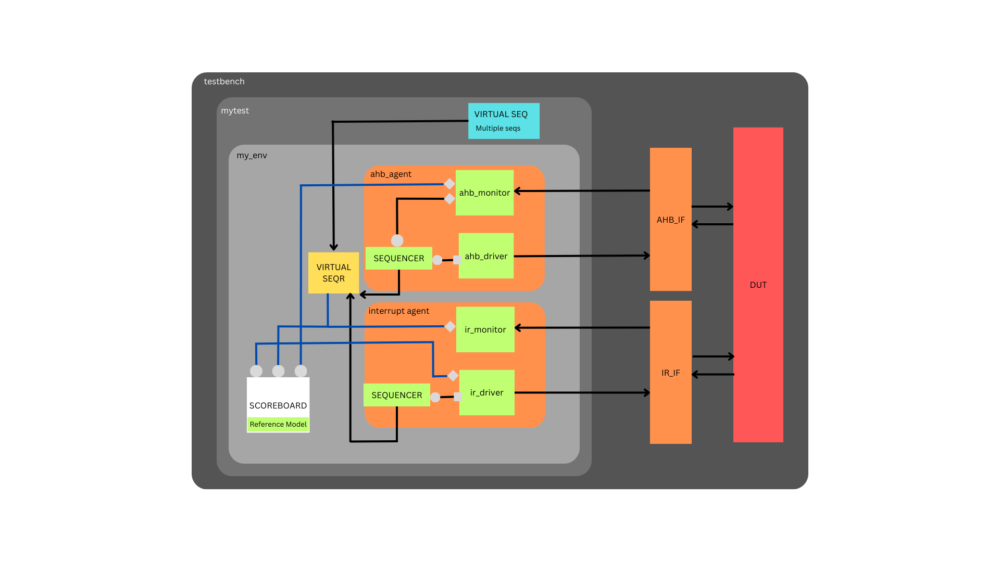

### DV environment for PLIC(Platform Level Interrupt Controller) 

#### Description

* The AHB-Lite PLIC IP core is a fully parameterized Platform-Level Interrupt Controller,
featuring a single AHB-Lite Slave interface and support for a user-defined number of both
Interrupt Sources and Targets.
* The purpose of the PLIC core is to connect multiple interrupt sources to one or more
interrupt targets. The core supports a programmable number of simultaneous pending
interrupt requests per source and individual routing of those interrupt requests to each
target.
* PLIC connects global interrupt sources, which are usually I/O devices, to interrupt targets.
* Global interrupts from various sources are processed by an interrupt gateway, which consolidates them into a single interrupt request for the PLIC core. The core manages interrupt priorities, enabling specific interrupts for each target. When enabled interrupts have a priority greater than the threshold, the core notifies targets to claim and service the highest-priority interrupt, clearing the pending bit. After servicing, the interrupt gateway can forward additional requests for the same source to the PLIC.

#### AHB-Lite Interface:

PLIC uses AHB bus to configure it’s registers before staring an interrupt and after interrupt is completely served the claim signal is also sent by this bus. 

The simplest transfer is one with no wait states, so the transfer consists of one address cycle and one data cycle. First Address Phase comes and then data phase, this is controlled by asserting wait states in driver and monitor.

#### PLIC Interface:

SRC is input. If 0th bit in src is 1 it will send interrupt through first source to the target. For example:

src=16'hFFFF;

This will send 16 interrupts from sources at a time to target.

#### Registers:

Registers are configured by using AHB protocol. By setting parameters total number of registers are made and their appropriate addresses are given by design. Than we configure these register by using that addresses. First we assert h_write=1 and at a particular address h_addr we give data h_wdata to configure register. Than we can read them too by doing h_write=0 and giving address to see if they are configured correctly.  

There are total 5 registers that needed to understand before moving forward.

#### Config:

It is a read only register that will tell us about the parameter that we set of the design.  

#### EL:

It is one bit per source so 32 sources can be handle by one register. 0 means it is level triggered and 1 means it is edge triggered. Example: 

h_wdata==32'h0000FFFF;

This means setting 16 sources as edge triggered and remaining 16 to level trigger.

Level trigger means if more than one interrupt come and first one is not fully served than it will be ignored while if it is defined as edge triggered than this new interrupt will queued up  until the max pending count value of parameter.

#### IE:

It is a matrix of sources and targets. One bit in it tells about that this interrupt is enable for that particular target.

#### Priority:

Four bits in it is used to set a priority of one source. Normally three bits are used. So we can say that 32/4 = 8. So, 8 sources can have one register.

#### Threshold:

Every target has it’s separate threshold register.

#### VERIFICATION ENVIRONMENT:

##### Environment:

In environment there are two agents, one scoreboard and one virtual sequencer which is connected to the virtual seq of the test. In ENV we connect the individual sequencer to the virtual sequencer so we can run test from one class of virtual seq. Moreover all implementations port connected in this class that comes out of agents and connects to scoreboard. 

##### AHB_AGENT:

In this agent ahb protocol slave is implemented. This agent is connected to its particular ahb_if interface. In this agent I make sequences of setting the register through driver sending data to interface and monitoring it through monitor. Than I read the sent data of registers. Moreover through this agent I check the claim and complete response by checking id register. There is one port and export between sequencer and driver while there are two analysis ports in the monitor one is to check the ID>0 and run claim and complete response for this purpose made an fifo in sequencer and defined it as p sequencer and get it in claim and complete’s sequence and other port is to pass data straightly to the scoreboard’s implementation port.

##### IR_AGENT:

This agent send interrupts to the DUT using the IR_IF interface. In this agent I send the sequence of interrupt pulse through driver which sends data to interface and monitor output through monitor class. There is one port and export between sequencer and driver while there are two analysis ports. One is to src signal to scoreboard for checking purpose while other is connected to two things one virtual sequencer because if IRQ>0 then we have to start claim and complete sequences and other is to send data to scoreboard for checking purpose. Moreover this agent’s sequencer is also connected to the virtual sequencer.

##### Scoreboard:

The scoreboard has three implementations ports. I made dummy registers in my scoreboard too. Whenever write comes of ahb I also write data in my dummy registers and whenever read comes I compare the written data with the read data coming out of DUT. Then I made a local variable to store interrupt signal because it is changed when irq is asserted. When I receive IRQ greater than one I check if the registers are configured correctly than I check src is asserted and then I check claim signal and pass the test.

##### Virtual Sequencer and Sequences:
Virtual sequencer is defined as p sequencer in virtual seq class because I need to run sequences of particular kind on the particular sequencers. Virtual seq holds all the sequences of ahb_agent as well as ir_agent. Similarly, Virtual sequencer holds the sequencer of both  ahb_agent as well as ir_agent.